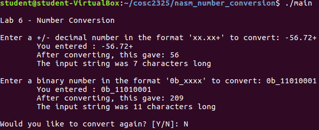

This is a project that combines x86 nasm assembly language and C++ to accomplish three things:

* 1. Return the length of a string
* 2. Convert a string of decimal digits to an unsigned integer
* 3. Convert a string of binary digits into an unsigned integer

The three functions (n_len, n_dtoi, n_btoi) exist inside of 'numbers.asm' and are called inside of main.cpp. Additional input validation takes place inside of main.cpp as well.

To build:

* $ g++ main.cpp -c -o main.o
* $ nasm numbers.asm -f elf64 -o numbers_def.o
* $ g++ main.o numbers_def.o -o main

To run:

* $ ./main

Enter the correct number formats:

* Decimal to unsigned integer: 'xx.xx+'
* Binary to unsigned integer: '0b_xxxx'

Program output:

